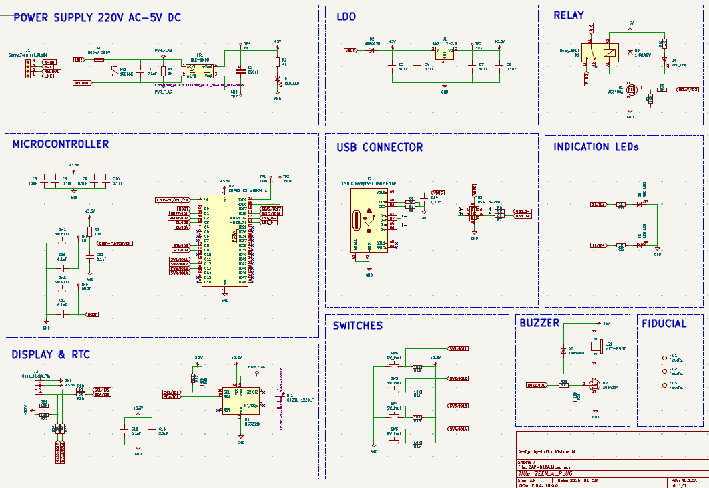
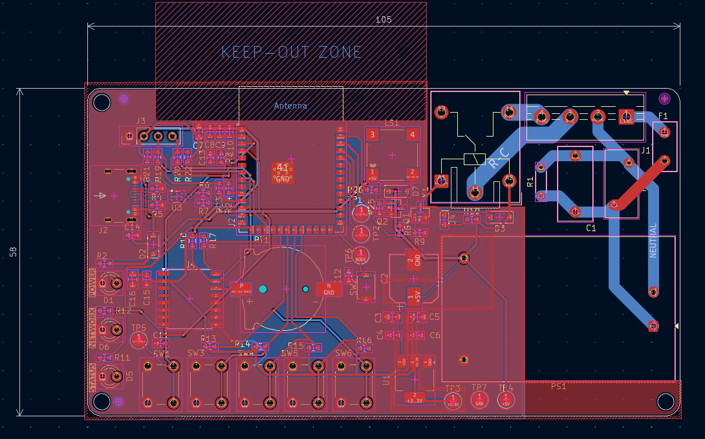
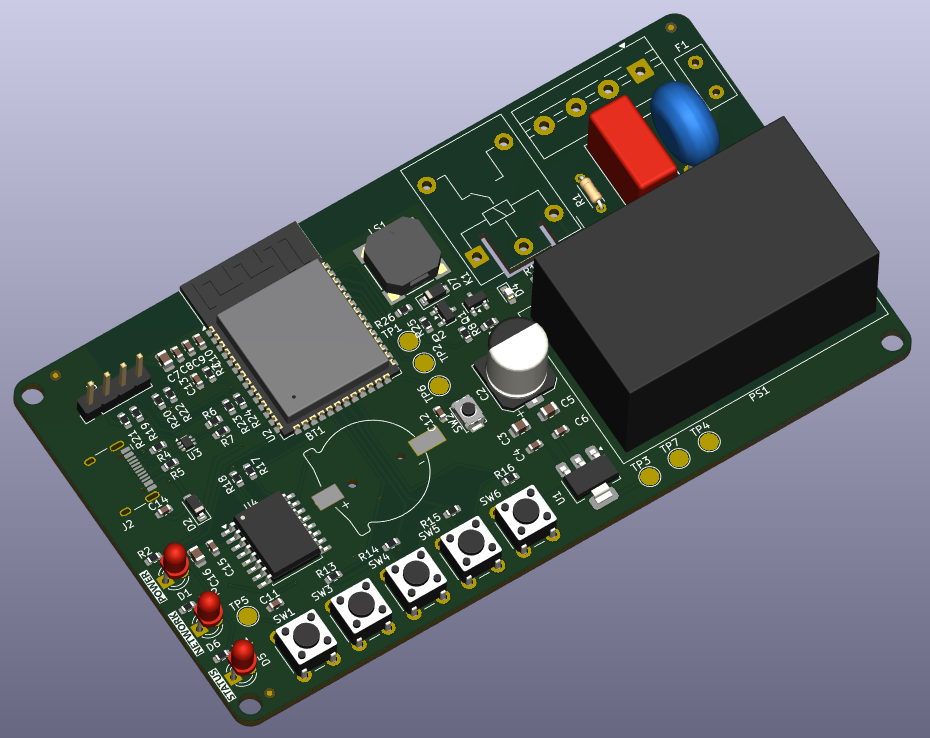

# ⚡ ESP32 Smart Plug — Hardware Reference Design
*A compact and efficient smart plug built around the ESP32-S3 for intelligent power control, protection, and connectivity.*

This project presents the schematic and PCB design of a smart plug capable of switching AC loads while supporting modern embedded features such as USB connectivity, RTC support, and protection circuitry. Designed to explore real-world embedded hardware development and PCB design practices.

> 📺 This project was developed by following a YouTube playlist by **Ampnics**, with additional learning and implementation.

---

## ⚙ Working Principle

* The system uses an **ESP32-S3 microcontroller** as the core processing unit.
* AC mains input is stepped down and regulated to provide safe DC power for the controller.
* A **relay switching circuit** enables the ESP32 to control connected appliances.
* Protection components safeguard the device against voltage spikes and electrical faults.
* USB connectivity allows programming and debugging.
* RTC support enables future time-based automation features.

---

## 📌 Objective
To design and develop a reliable hardware platform for a smart plug that demonstrates safe mains power handling, embedded control, and scalable architecture for future IoT-based automation.

---

## ⚙ Components Used

| No. | Components              | Specifications / Role |
| :---: | :-----------------------: | :--------------------: |
| 1. | ESP32-S3 Module | Main microcontroller with Wi-Fi & BLE |
| 2. | Relay | AC load switching |
| 3. | AC-DC Power Module | Converts mains to regulated DC |
| 4. | Voltage Regulators | Stable voltage supply |
| 5. | Protection Circuitry | Fuse, MOV, flyback diode, etc. |
| 6. | USB Interface | Programming & debugging |
| 7. | Capacitors & Resistors | Filtering and biasing |
| 8. | RTC (Optional) | Time-based control support |

---

## 📷 Preview

### 🖼 Schematic Diagram  

  

### 📐 PCB Layout  

  

### 🧊 3D View  

  

---

## 🧠 Design Highlights

- Proper isolation between AC mains and low-voltage sections  
- Dedicated power zoning for noise reduction  
- Flyback protection for relay reliability  
- USB interface for easy firmware flashing  

---

## ⚠ Safety Considerations

- Isolation maintained between high-voltage and low-voltage domains  
- Proper creepage and clearance followed  
- Fuse and MOV used for protection  
- Designed for educational and prototyping purposes only  

---

## 📊 Specifications

| Parameter | Value |
|----------|------|
| Input Voltage | 230V AC |
| Output Control | Relay-based switching |
| MCU | ESP32-S3 |
| Communication | Wi-Fi, BLE |

---

## 🚀 Key Highlights

✅ Designed with real-world electrical safety considerations  
✅ Suitable for home automation applications  
✅ Expandable for IoT integration  
✅ Compact PCB layout  
✅ Industry-relevant hardware design workflow  

---

## 🔄 Future Improvements

- Energy monitoring (current & voltage sensing)  
- Mobile app / cloud integration  
- Overload and thermal protection  
- Smart scheduling and automation  
- Voice assistant compatibility  
- Custom enclosure design  
- Power consumption optimization  
  

---

⭐ *This project is part of my learning journey in hardware design and PCB development.*
